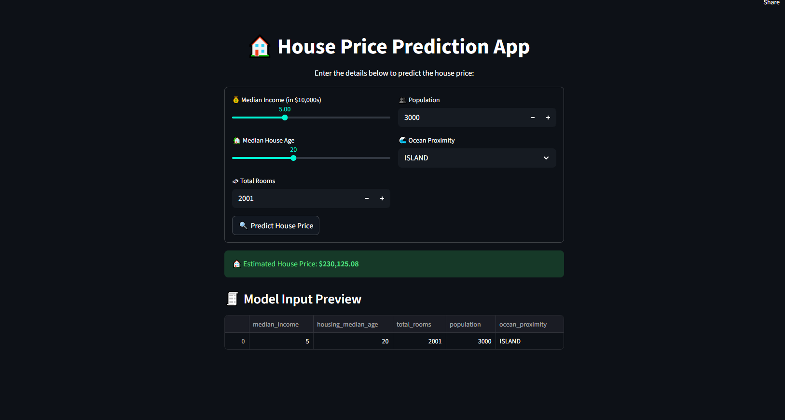

# 🏡 House Price Prediction (California Housing Dataset)

An end-to-end Machine Learning project to predict **California median house prices** using census data.  
This project includes **data analysis, preprocessing, feature engineering, model training**, and a **beautifully deployed web app** built with Streamlit.

---

## 🌐 Live App  

🔗 [Click here to try the app](https://housepricepredictionmlpp-jkpeappl7mkxhhkq4hnyxyf.streamlit.app/)

---

## 📌 Problem Statement  

Using the **1990 California Census data**, predict the median house value for neighborhoods ("block groups") based on features like **median income**, **population**, **total rooms**, and **ocean proximity**.

---

## 📁 Dataset  

- **Source:** California Housing Dataset (Hands-On ML)  
- 🏘 **20,640 entries**, 10 attributes (9 numerical, 1 categorical)

---

## 🧠 Key Features  

- `median_income`
- `housing_median_age`
- `total_rooms`
- `population`
- `ocean_proximity` *(categorical)*

---

## 🧪 Data Preprocessing  

- ✅ Handled missing values using **SimpleImputer**  
- ✅ Created new features:  
  - `rooms_per_household`  
  - `bedrooms_per_room`  
  - `population_per_household`  
- ✅ Encoded categorical column using **OneHotEncoder**  
- ✅ Applied **StandardScaler** for normalization  
- ✅ Used **Stratified Sampling** to ensure fair train-test split  
- ✅ Built a reusable preprocessing pipeline with **Pipeline** & **ColumnTransformer**

---

## 📊 EDA & Visualization  

- 📈 Histograms for feature distributions  
- 🗺️ Scatter plot of house prices by location (longitude vs latitude)  
- 🔗 Correlation matrix to find key predictors  
- 📑 `scatter_matrix()` to visualize relationships between top features  

---

## 🧮 Model Training  

- **Initial Model:** Linear Regression (Scikit-Learn)  
- **Advanced Model (Web App):** XGBoost Regressor  
- Trained on fully processed data  
- Evaluated predictions on the test set  

---

## 🧾 Sample Predictions  

| Row | Predicted ($) | Actual ($) |
|------|--------------|------------|
| 1 | 85,658 | ~66,900 |
| 2 | 305,493 | ~303,900 |
| 3 | 152,056 | ~103,500 |
| 4 | 186,096 | ~146,600 |
| 5 | 244,551 | ~192,400 |

💡 These predictions show good generalization and capture overall trends.

---

## 💡 Learnings  

- Building a **full ML pipeline** from scratch  
- **Feature engineering** to improve model performance  
- Why **stratified sampling** improves fairness  
- How to analyze **correlation** and **geospatial data**  
- Deploying a real model as a **web app** for instant predictions  

---

## 🔧 Tools & Libraries  

- **Python (Colab + VSCode)**  
- **Pandas, NumPy, Matplotlib, Seaborn**  
- **Scikit-Learn** (Pipeline, ColumnTransformer, LinearRegression, StandardScaler)  
- **XGBoost** (for production model)  
- **Streamlit** (for web app UI)  

---

## 📷 Web App Preview  

---

## 📎 Project Highlights  

- ✅ **End-to-end pipeline** built with reusable code  
- ✅ **Real-world data cleaning & visualization**  
- ✅ **Beautiful Streamlit UI** with dark theme  
- ✅ **Live Deployed App** with XGBoost predictions  

---

⭐ **Star this repo** if you found it helpful — or fork and extend with advanced models like Random Forest or Gradient Boosting!
